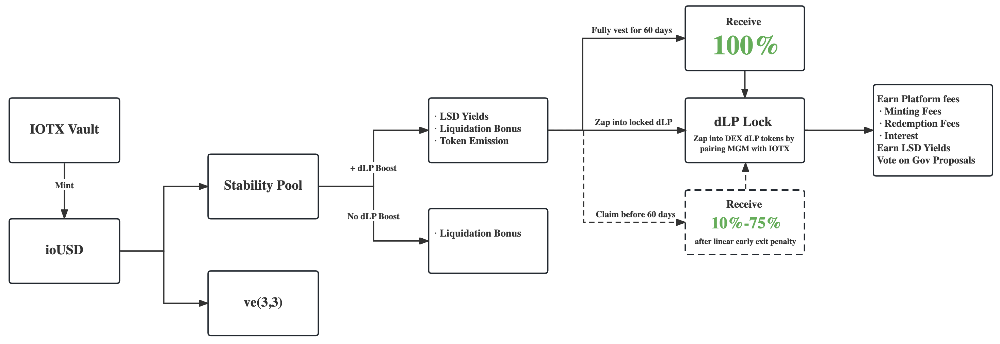

# Flywheel

## A Sustainable Flywheel&#x20;

We value long term sustainability greatly. To align the economic system and tokenomics with long-term investors, we innovated based on several existing mechanisms.

Here is how the whole Magma mechanism as it is proposed to work:

<figure><figcaption>
A sustainable flywheel of real yield and value capture mechanics
</figcaption></figure>

## **Pyro Mode**

Inspired by Radiant Capital, Magma proposes its Pyro Mode, where users lock dLP, aka dynamic Liquidity Provisioning, to earn governance power and additional rewards:

1. Activate $MGM emissions and LSD yields in the Stability Pool
2. Share platform fees comprised of minting fees, redemption fees, etc.
3. Obtain voting power for governance via the Magma DAO

Users that simply deposit in Stability Pool but don't add value to the protocol will continue to earn natural pool rates which mainly comes from liquidation, but will not be eligible for $MGM emissions and LSD yields.

## dLP Mechanism

Users depositing ioUSD in the Stability Pool that lock their dynamic liquidity tokens (dLP) are interacting and providing utility to the platform. This allows them to capture the added value from the communities’ engagement through the native token, $MGM. Locked dLP is subject to a binding variable lock time (1 month to 1 year), which cannot be unlocked before this time.


**To trigger Pyro Mode, you must lock at least 5% of your deposit's USD value in dLP tokens.**



**Example 1:** If you deposit $1M ioUSD in Stability Pool but have zero dLP tokens locked, you'll earn the basic APY which mainly comes from liquidation but won't qualify for additional $MGM emissions and LSD yields.



**Example 2:** Deposit $1,000 ioUSD in Stability Pool and lock $50 in dLP tokens. Now you're eligible for $MGM emissions and LSD yields from staked IOTX, thanks to hitting that 5% threshold.


**The requirement to lock liquidity tokens in dLP serves the Magma Protocol in multiple ways:**

1. **Long-Term Participation:** Locking dLP tokens effectively commits users to a set period, increasing the likelihood that they'll maintain their deposited collateral.
2. **$MGM Emissions Activation:** This commitment enables $MGM emissions, rewarding those who are invested in the protocol's long-term vision.
3. **Attracting New Users:** The above dynamics make the Magma Protocol more appealing to potential liquidity providers, thereby stimulating both growth and development.

This strategic cycle not only sustains long-term liquidity, but also catalyses new inflows, making it a win-win for both individual users and the protocol itself.

## Vesting MGM

### **To begin vesting MGM** 

**MGM must actively vest** and reach the 60-day maturity date to receive the full amount.

**MGM Vesters** that engage and provide utility to the platform can capture the added value from the communities’ engagement within the money markets through MGM emissions. Users can exit early from their vesting, incurring a 25-90% penalty fee, or complete the 60-day vesting period to receive the full amount.

The penalty paid is returned to the Magma DAO Reserve to increase the emissions runway.

## Zapping dLP

### **What is Zapping?** 

If you have ETH and want a position in the Balancer RDNT-ETH pool, it can be a painful process to get into that position. First, you must supply RDNT and ETH in the appropriate proportions, which takes four transactions. Zapping allows you to do it in one click.

### **Zap Vesting MGM into dLP** 

Once MGM is vesting, zap into locked dLP with no exit penalty to begin receiving platform revenue and attain eligibility for Pyro Mode. Zapping with vesting MGM can only be executed for the full vesting amount.
