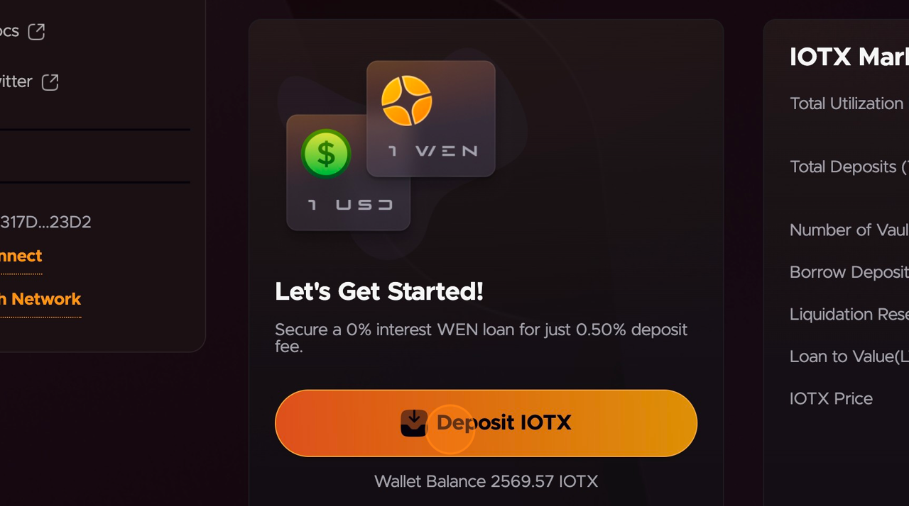
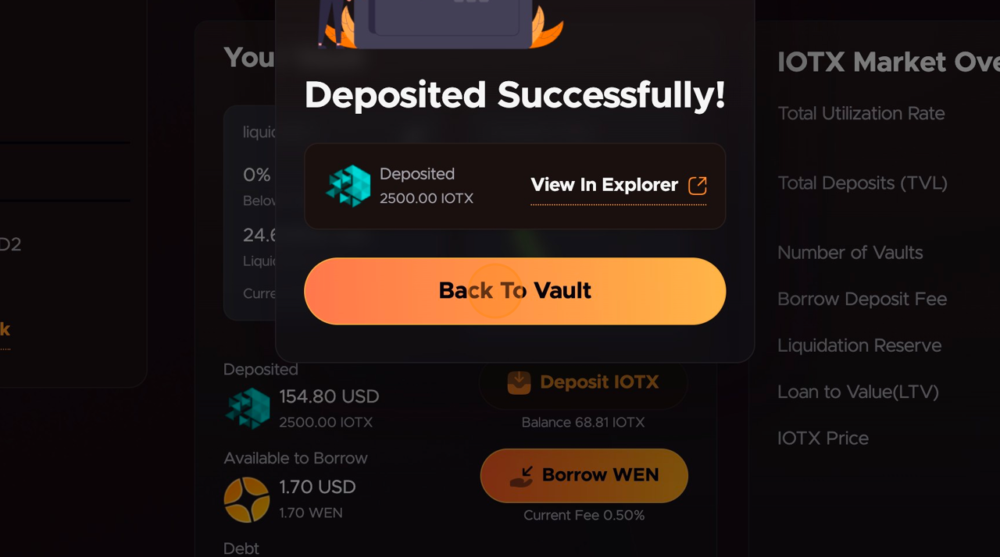

# Simple Visual Tutorial

How to Deposit IOTX, Borrow `ioUSD` (and Stake `ioUSD` in the Stability Pool) on Magma Protocol&#x20;


The Magma `WEN` stablecoin has now been renamed to `ioUSD`. The website is being updated to reflect this change. Once these updates are completed, this tutorial will also be updated.

The tutorial still describes how to mint ioUSD using IOTX, _and now uniIOTX too_, as collateral. **Any mention of `WEN` below refers to the `ioUSD` stablecoin from Magma.**


### Connect Wallet to Magma&#x20;

1. Navigate to https://app.magma.finance/&#x20;
2. Connect Web3 wallet to app.magma.finance (MetaMask, TokenPocket, Enkrypt. etc.)&#x20;

### Deposit IOTX as collateral and borrow `ioUSD`&#x20;

3. Click "Deposit IOTX"&#x20;

<figure><figcaption></figcaption></figure>

4. Click the "Deposit amount" field.&#x20;

<figure><figcaption></figcaption></figure>

5. Enter number of IOTX tokens to deposit as collateral.&#x20;

<figure><figcaption></figcaption></figure>

6. Click "Borrow"&#x20;

<figure><figcaption></figcaption></figure>

7. Click the "Borrow amount" field.
8. Enter how many `ioUSD` you wish to borrow.&#x20;
9. Click "Deposit" and approve transaction in your Web3 wallet.&#x20;

<figure><figcaption></figcaption></figure>

10. Click "Back To Vault" Staking `ioUSD` in the Stability Pool&#x20;

<figure><figcaption></figcaption></figure>

11. Click "Stake `ioUSD`" in the sidebar menu.&#x20;

<figure><figcaption></figcaption></figure>

12. Click "Stake".

<figure><figcaption></figcaption></figure>

13. Click "Max: xxx.xx `ioUSD`" if you want to stake all your `ioUSD`. Or enter the number of `ioUSD` you wish to add to the Stability Pool in the Stake Amount field.

<figure><figcaption></figcaption></figure>

14. Click "Stake `ioUSD`"&#x20;

<figure><figcaption></figcaption></figure>
