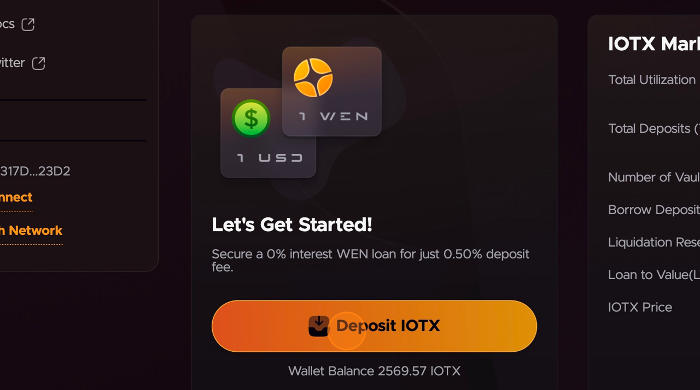
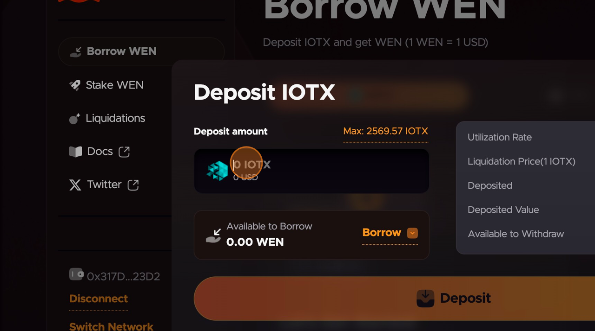
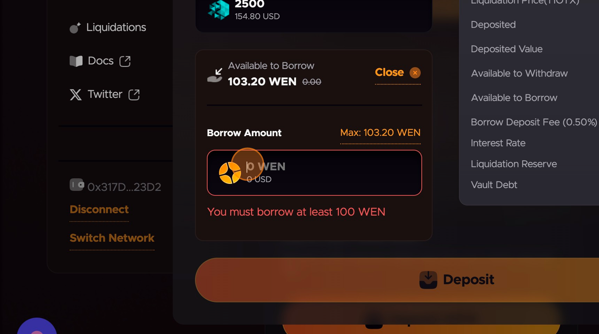
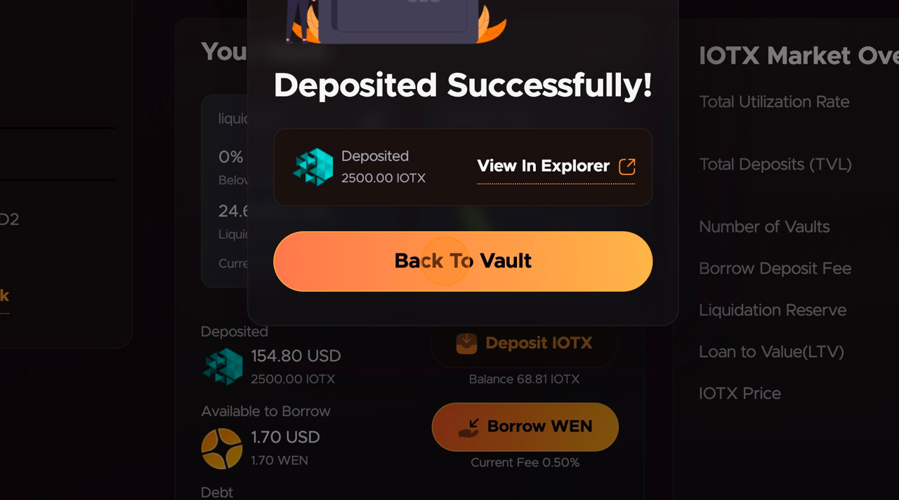
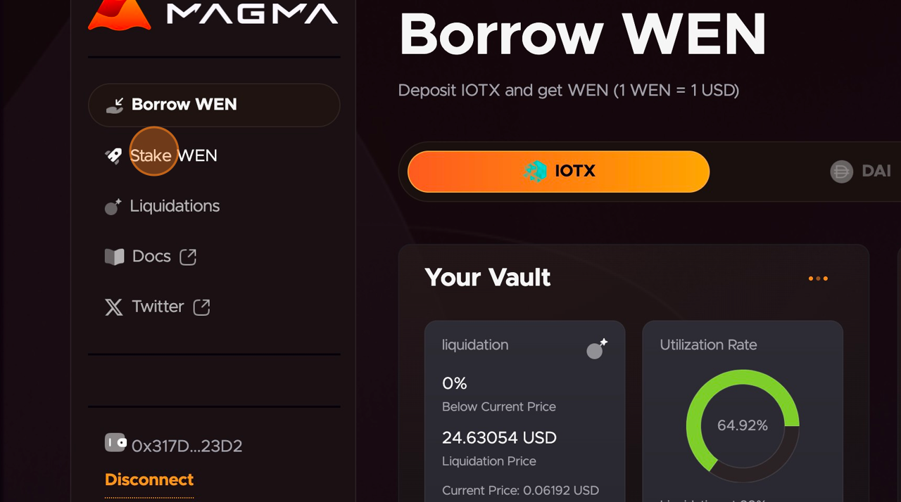
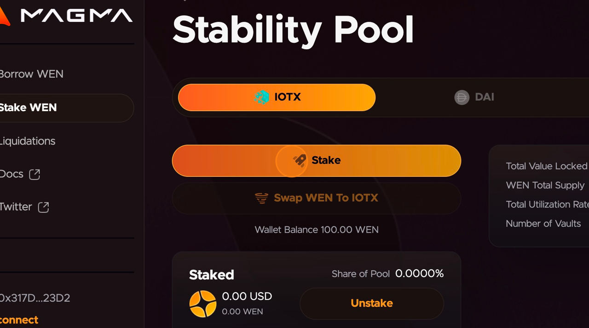
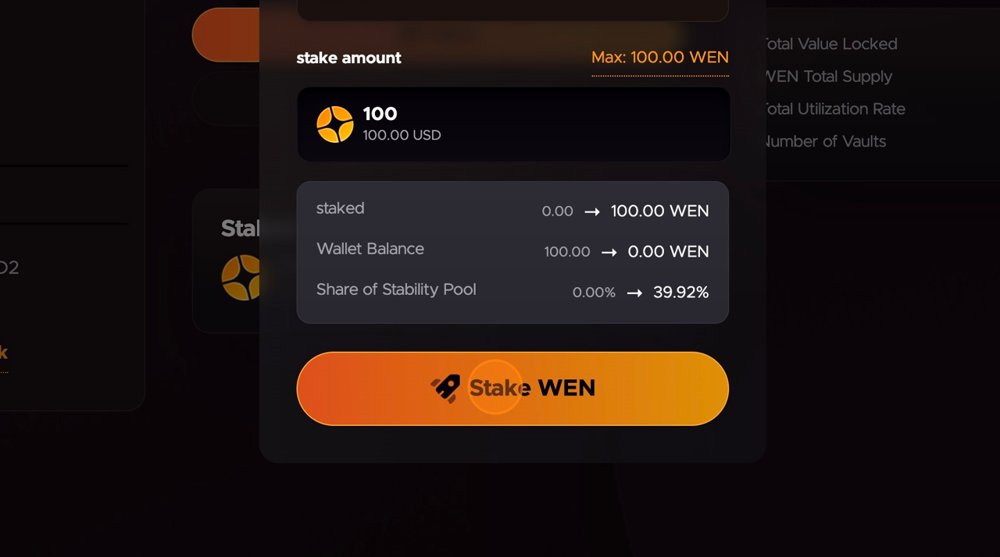

# Visual Basic Tutorial

How to Deposit IOTX, Borrow WEN (and Stake WEN in the Stability Pool) on Magma Protocol&#x20;

### Connect Wallet to Magma&#x20;

Navigate to https://app.magma.finance/&#x20;

Connect Web3 wallet to app.magma.finance (MetaMask, TokenPocket, Enkrypt. etc.)&#x20;

### Deposit IOTX as collateral and borrow WEN&#x20;

3 Click "Deposit IOTX"&#x20;

<figure><figcaption></figcaption></figure>

4 Click the "Deposit amount" field.&#x20;

<figure><figcaption></figcaption></figure>

5 Enter number of IOTX tokens to deposit as collateral.&#x20;

<figure><figcaption></figcaption></figure>

6 Click "Borrow"&#x20;

<figure><figcaption></figcaption></figure>

7 Click the "Borrow amount" field.

8 Enter how many WEN you wish to borrow.&#x20;

9 Click "Deposit" and approve transaction in your Web3 wallet.&#x20;

<figure><figcaption></figcaption></figure>

10 Click "Back To Vault" Staking WEN in the Stability Pool&#x20;

<figure><figcaption></figcaption></figure>

11 Click "Stake WEN" in the sidebar menu.&#x20;

<figure><figcaption></figcaption></figure>

12 Click "Stake".

<figure><figcaption></figcaption></figure>

13 Click "Max: xxx.xx WEN" if you want to stake all your WEN. Or enter the number of WEN you wish to add to the Stability Pool in the Stake Amount field.

&#x20;

<figure><figcaption></figcaption></figure>

14 Click "Stake WEN"&#x20;

<figure><figcaption></figcaption></figure>
